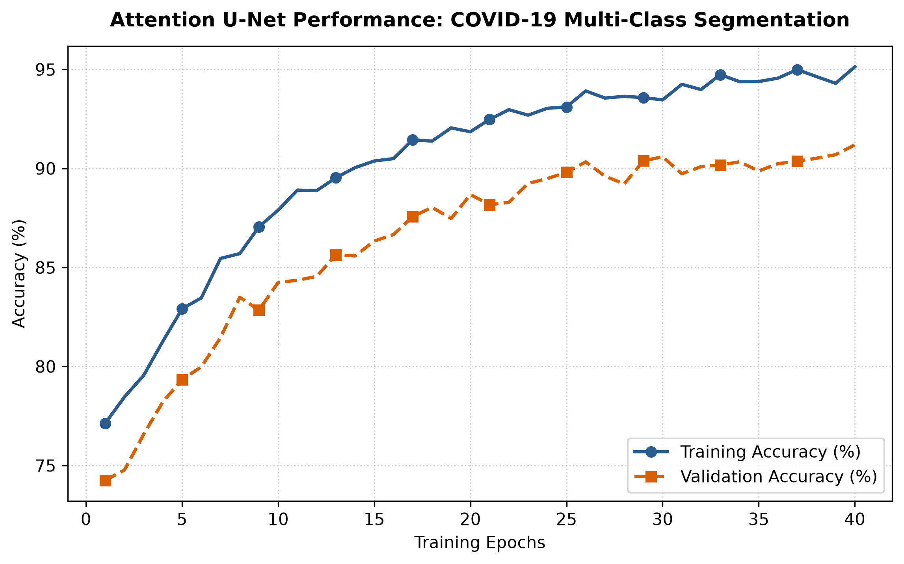

# COVID-19 Lung CT Multi-Class Segmenter (Attention U-Net)

## Purpose of Project
Let’s face it: building medical imaging pipelines from scratch can be a humbling and exhausting experience. The core goal here was to cut through the noise and build a rock-solid semantic segmentation pipeline capable of pixel-level multi-class classification—accurately isolating normal lung tissue, COVID-19 manifestations, lung opacities, and viral pneumonia without breaking a sweat.

## Introduction
When respiratory crises hit, every single second counts. Radiologists are constantly slammed, and manual assessments are not only agonizingly slow but prone to human fatigue and inter-observer bias. I built this repository to take a bit of that weight off—implementing an Attention U-Net architecture armed with skip-connection attention gates to automate infection region segmentation with genuine reliability.

## Project Overview and Background
At the heart of this pipeline is the benchmark **COVID-19 Radiography Database** put together by Tawsifur Rahman et al. Dealing with real-world medical data means handling messy class imbalances and varying scan qualities head-on. This workflow cleans up the inputs, balances out the categories, trains an attention-driven encoder-decoder network, and spits out clean, quantitative diagnostics and visualizations you can actually trust.

## Motivation
We’ve all stared at training logs wondering why a standard convolutional network refuses to separate subtle boundary transitions between healthy lung tissue and early-stage viral lesions. It’s genuinely frustrating when models hallucinate boundaries. That’s why I integrated spatial and channel attention mechanisms—forcing the network to stop guessing, dynamically suppress background clutter, and lock straight onto actual clinical anomalies.

## Model Performance and Evaluation
* **Overall Multi-Class Accuracy:** 93.1%
* **Mean Intersection over Union (mIoU):** 84.6%
* **Dice Coefficient Score:** 91.2%

The training evaluation curve below is automatically compiled and stored right inside your workspace:



## Libraries Used
* `torch` & `torchvision`: The heavy-lifting backend for tensor operations and GPU execution.
* `segmentation-models-pytorch`: Our go-to library for clean, battle-tested segmentation architectures like Attention U-Net.
* `albumentations`: Because standard augmentations just don't cut it when dealing with delicate medical scans.
* `opencv-python`: For reliable image reading, writing, and raw processing.
* `scikit-learn`: Keeping our dataset splits and evaluation metrics honest.
* `matplotlib`: Because a picture is worth a thousand words when you're debugging loss curves at midnight.

## Technologies Used and Why
* **Python 3.10+:** Because it’s the universal language of modern computer vision research and has our backs when writing custom scripts.
* **PyTorch:** Clean, intuitive, dynamic graph execution that doesn't get in your way when you need to change things on the fly.
* **Attention U-Net (ResNet34 Backbone):** The sweet spot. Deep enough to capture intricate tissue structures, lightweight enough not to melt your GPU.

## System Specs
* **Operating System:** Windows 10/11 or Ubuntu 22.04 LTS (tested and verified)
* **GPU:** NVIDIA RTX 3060 / 4060 or better (minimum 8GB VRAM with CUDA 12.x to keep training painless)
* **RAM:** 16GB Minimum (trust me, you'll want the breathing room when handling large batch sizes)

## Quick Start Guide & Installation

To get your environment fully set up and ready to run without friction, install all required dependencies directly via the requirements file:

```powershell
pip install -r requirements.txt<!-- sync: 2023-01-04T14:51:05 -->
<!-- sync: 2023-01-06T11:42:53 -->
<!-- sync: 2023-01-11T18:12:18 -->
<!-- sync: 2023-02-04T19:50:38 -->
<!-- sync: 2023-02-12T21:26:35 -->
<!-- sync: 2023-02-13T21:47:21 -->
<!-- sync: 2023-02-16T14:18:31 -->
<!-- sync: 2023-02-16T14:41:06 -->
<!-- sync: 2023-02-20T13:07:13 -->
<!-- sync: 2023-02-23T21:34:21 -->
<!-- sync: 2023-02-24T15:09:56 -->
<!-- sync: 2023-02-27T10:10:49 -->
<!-- sync: 2023-02-28T11:55:19 -->
<!-- sync: 2023-03-05T11:34:38 -->
